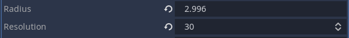
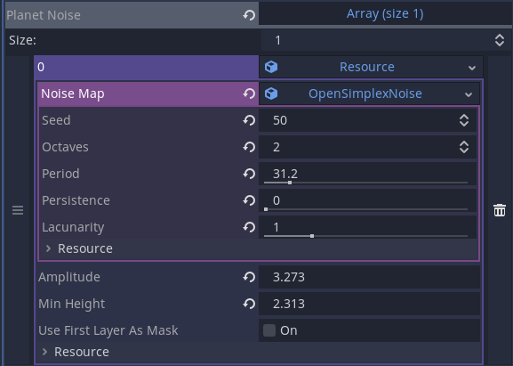

# Games Engines 1 Assignment
## Procedurally Generated Planets

This is a procedurally generated planet maker made in Godot. Planets can have different shapes, sizes, colours, features and patterns. Examine your planet using your mouse or VR headset.

## Instructions

Import your planet scene and configure your planet.

### Planet size

The radius will determine the size of your planet

The resolution will control how high quality your planet will be. A low resolution planet will be blocky, polygon-like, and pixel-like. A higher resolution will have a smoother surface with well defined features.

### Planet noise

This will generate your features. Choosing a seed will create a random set of features sticking out of your planet.

The period slider will change your features shape. A lower period will result in many skinny sharp spikes coming out of the planet. A higher period will be smoother and rounded features.

Persistance will control how much these features protrude out of your planet.

Amplitude makes your features bigger or smaller.

Min-height will sink these features into the planet, making them smaller.
